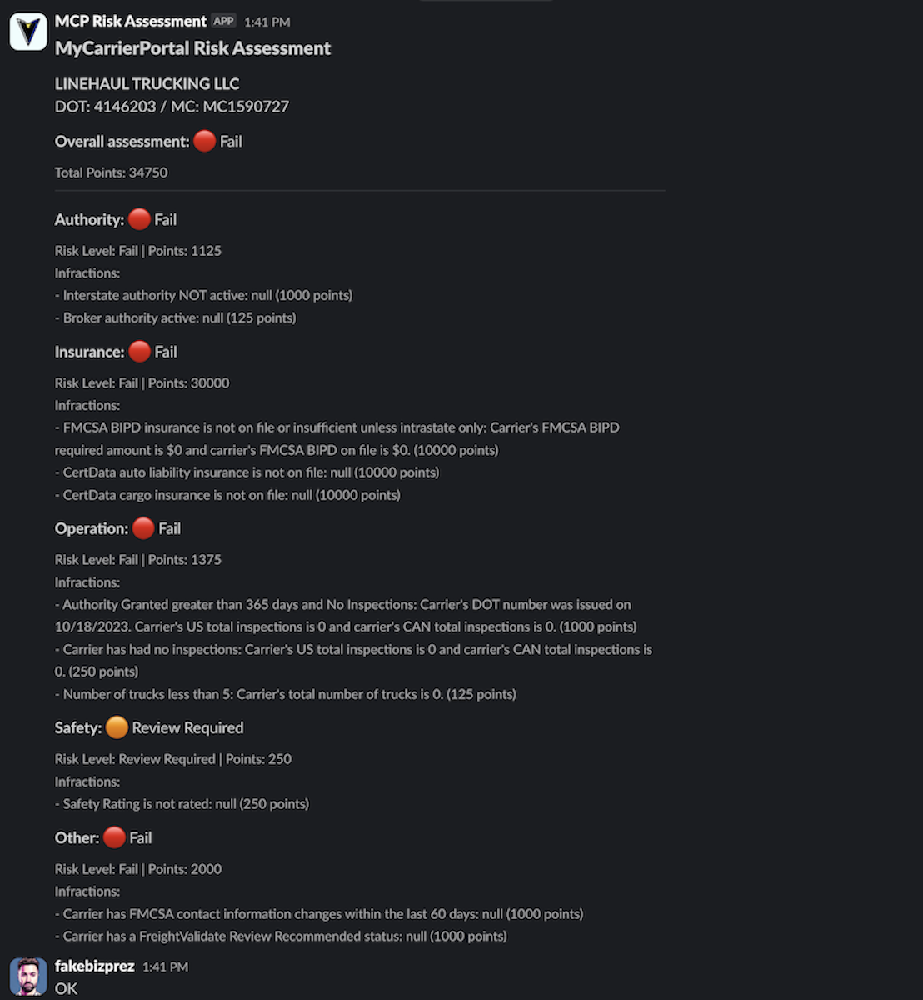

# MCP Slackbot (Python Version)

A Slack bot for executing Carrier Risk Assessments using the MyCarrierPortal API within your Slack environment. This version is built with Python using the Bolt for Python framework.

*Original concept by Anthony Fecarotta of freightCognition & linehaul.ai*

 <!-- Assuming screenshot is still relevant -->

## Prerequisites

- Docker and Docker Compose (Recommended)
- A Slack workspace with permissions to add apps
- MyCarrierPortal API access (including Bearer Token, Refresh Token, and Token Endpoint URL)
- Python >= 3.10 (if not using Docker)
- `uv` (Python project and environment manager, if not using Docker)

## Quick Start with Docker Compose

1.  **Clone the repository:**
    ```bash
    git clone https://github.com/freightcognition/mcp-slackbot.git
    cd mcp-slackbot
    ```
2.  **Configure environment variables:**
    *   Copy `.env.example` to `.env`:
        ```bash
        cp .env.example .env
        ```
    *   Edit `.env` and fill in your credentials (see "Environment Variables Summary" below). Key variables include:
        *   `BEARER_TOKEN`, `REFRESH_TOKEN`, `TOKEN_ENDPOINT_URL`
        *   `SLACK_SIGNING_SECRET`
        *   `SLACK_WEBHOOK_URL` (optional, for specific notifications if used by the app logic beyond command responses)
        *   `PORT` (default: `3000`)

3.  **Start the application:**
    ```bash
    docker compose up -d
    ```
    The service name in `docker-compose.yml` is `mcp-slackbot-py`.

4.  **Verify the application is running:**
    ```bash
    # Check container status
    docker compose ps

    # View logs
    docker compose logs -f mcp-slackbot-py
    ```
    You can also check the health endpoint: `curl http://localhost:YOUR_PORT/health` (e.g., `curl http://localhost:3000/health`).

## Alternative Deployment Methods (Without Docker)

If you prefer not to use Docker, you can run the application directly using Python and `uv`.

### Prerequisites for Direct Deployment
- Python >= 3.10
- `uv` (install via `pip install uv` or from https://github.com/astral-sh/uv)

### Setup and Running

1.  **Create and activate a virtual environment (optional but recommended):**
    ```bash
    # Using uv to create a venv in .venv directory
    uv venv
    source .venv/bin/activate  # On Linux/macOS
    # .\.venv\Scripts\activate   # On Windows
    ```

2.  **Install dependencies:**
    ```bash
    uv pip install -r requirements.txt
    ```

3.  **Configure environment variables:**
    Create a `.env` file in the project root (as described in step 2 of the Docker setup) with all the necessary tokens and URLs.

4.  **Run the application using Uvicorn:**
    ```bash
    # Ensure PORT env var is set or use default 3000
    # Example: export PORT=3000
    uvicorn src.app:asgi_app --host 0.0.0.0 --port ${PORT:-3000} --reload
    ```
    The `--reload` flag is for development and automatically reloads the server on code changes. Remove it for production.

## Slack App Configuration

To use this bot, you need to create or update your Slack App:

1.  Go to [https://api.slack.com/apps](https://api.slack.com/apps) and select your app or "Create New App".
2.  **Slash Commands:**
    *   Navigate to "Features" -> "Slash Commands".
    *   Click "Create New Command" or edit your existing one.
    *   **Command:** `/mcp-preview` (or your preferred command, matching the one in `src/app.py`)
    *   **Request URL:** `https://your-public-url.com/slack/events` (This needs to be the publicly accessible URL where your bot is running. For local development, you'll need a tunneling service like ngrok: `ngrok http ${PORT:-3000}`).
    *   **Short Description:** e.g., "Fetch MCP Carrier Risk Assessment"
    *   Save the command.
3.  **Event Subscriptions (If using other Slack events beyond slash commands):**
    *   Navigate to "Features" -> "Event Subscriptions".
    *   Toggle "Enable Events" to ON if you plan to use them.
    *   **Request URL:** `https://your-public-url.com/slack/events`. The URL will be verified.
4.  **Permissions (OAuth & Permissions):**
    *   Navigate to "Features" -> "OAuth & Permissions".
    *   **Bot Token Scopes:** Add necessary scopes. For the current functionality, you primarily need:
        *   `commands` (for slash commands)
        *   `chat:write` (used by Bolt's `respond()` and `say()` to send messages)
    *   Install or reinstall the app to your workspace. This generates/updates the **Bot User OAuth Token**. While the current app initialization (`AsyncApp(token=None, ...)`) doesn't directly use a bot token for handling slash commands via HTTP, some `client` operations or future event handling might require it. If you need to use `client.chat_postMessage` with a bot token, you'd set `SLACK_BOT_TOKEN` in your `.env` and initialize `AsyncApp(token=os.environ.get("SLACK_BOT_TOKEN"), ...)`.

5.  **App Credentials:**
    *   Navigate to "Settings" -> "Basic Information".
    *   Find your **Signing Secret** under "App Credentials" (`SLACK_SIGNING_SECRET`).

## Environment Variables Summary

-   **`BEARER_TOKEN`**: MyCarrierPortal API bearer token. (Required)
-   **`REFRESH_TOKEN`**: MyCarrierPortal API refresh token. (Required)
-   **`TOKEN_ENDPOINT_URL`**: MyCarrierPortal API token refresh endpoint. (Required)
-   **`SLACK_SIGNING_SECRET`**: Slack App Signing Secret. (Required)
-   **`SLACK_WEBHOOK_URL`**: Slack Incoming Webhook URL. (Optional, current version primarily uses `respond()` for slash commands, but this might be used for other notifications if implemented).
-   **`PORT`**: Port the application listens on (default: `3000`). (Optional)
-   **`SLACK_BOT_TOKEN`**: Slack Bot User OAuth Token (e.g., `xoxb-...`). (Optional for current slash command setup, but may be required for other Slack API interactions or event types).

## Testing

Unit tests are located in the `tests/` directory and can be run using Python's `unittest` module:

```bash
python -m unittest discover tests
```
Or, if you have specific test files:
```bash
python -m unittest tests.test_helpers
python -m unittest tests.test_token_refresh
```

## Security Notes

-   **Never commit your `.env` file (or any file with real credentials) to version control.** The `.dockerignore` file should prevent `.env` from being included in Docker builds, and `.gitignore` should prevent it from being committed.
-   Keep your API tokens and secrets secure.
-   Consider using a secrets management solution for production environments.
-   Regularly rotate your credentials if possible.
-   The `.env.example` file is a template and should **never** contain real credentials.

## License

This project is licensed under version 3 of the GNU Affero General Public License (AGPL-3.0). See the `LICENSE.TXT` file for details.
